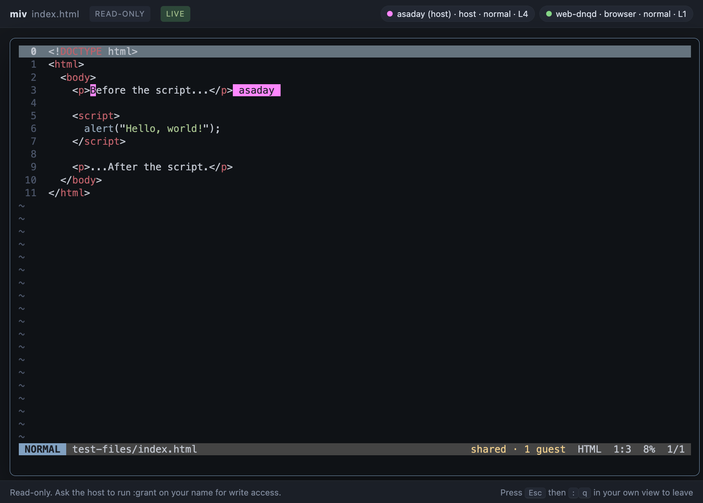

# Miv

A modal text editor for the terminal, written in Rust.

```
cargo install --path .
miv src/main.rs
```

Press `:help` inside the editor for the full key reference.



## Vim compatibility

**Modes** — normal, insert, replace (`R`), visual, visual line, plus the `:`
and `/` prompts.

**The full operator grammar**, not a list of special cases:
`["register]{count}{operator}{count}{motion-or-text-object}`. So `3dw`,
`d2f)`, `"ay}`, `2>>` and `ci"` all work because they are the same code path.

**Motions** — `h j k l`, `w W b B e E`, `0 ^ $ g_`, `gg G {n}G`, `f F t T`
with `;` and `,`, `{ }`, `%`, `H M L`, `|`, marks (`m` `` ` `` `'`), search
(`n N`), and the jump list (`Ctrl-O` / `Ctrl-I`).

**Operators** — `d c y`, `> <`, `gu gU g~`, each with a doubled line-wise
form (`dd`, `yy`, `>>`).

**Text objects** — `iw aw iW aW`, `i" i' i\``, `i( i[ i{ i<`, `ip ap`, each in
inner and around flavours.

**Editing** — `i a I A o O`, `x X s S D C Y`, `r`, `~`, `J`, `p P`, `u`,
`Ctrl-R`, and `.` to repeat the last change.

**Registers** — unnamed, `a`–`z` (uppercase appends), the yank register `0`,
the delete ring `1`–`9`, the blackhole `_`, and `+`/`*`, which copy to the
system clipboard over OSC 52 so it works through SSH and tmux.

**Macros** — `q{register}` to record, `q` to stop, `@{register}` to replay.
Macros are stored as editable text in registers, so `:reg` shows them and you
can yank one into a buffer and fix it.

**Search** — incremental, with match highlighting, `smartcase`, and wrapping.
`*` searches for the word under the cursor.

**Commands** — `:w :wq :x :q :q! :wa :wqa`, `:e :e!`, `:ls :b :bn :bp :bd`,
`:{line}`, `:s///` with ranges (`%`, `.`, `$`, `'<,'>`, `.,+5`), `:set`,
`:reg`, `:marks`, `:noh`, `:help`.

There is one window, so `:q` leaves the editor rather than closing a buffer
(`:bd` does that), and it refuses while any buffer is unsaved.

**Files** — multiple buffers, atomic saves, UTF-8, and round-tripping of CRLF
line endings and files with no trailing newline.

## Windows

```
Ctrl-W v        split side by side (also :vsplit)
Ctrl-W s        split stacked (also :split)
Ctrl-W w        next window; Ctrl-W hjkl to move by direction
Ctrl-W c / o    close this one / close the others
```

Each window is a view with its own cursor, viewport and scroll position, and
its own status line along the bottom — the active one is the one wearing the
mode badge. `:q` closes a window while others remain, and only leaves the
editor once it is the last one.

In a shared session each participant has their **own** windows and layout, so
one person splitting the screen does not rearrange anyone else's.

## Finding things

```
Ctrl-P          fuzzy-find a file in the project (also :files)
Ctrl-K          the command palette (also :commands)
:grep {pattern} search the project; Enter jumps to the hit
:buffers        pick from the open buffers
Ctrl-W e        show or hide the file explorer (also :explorer)
Ctrl-W E        move the keyboard to the explorer and back
```

One picker serves all of them, so the keys are the same everywhere: type to
filter, `Ctrl-N`/`Ctrl-P` or the arrows to move, `Enter` to take it, `Esc` to
leave. Matching is fuzzy and path-aware — `src/mn` finds `src/main.rs` — and
the file list honours `.gitignore`. Backspacing past the start of an empty
query closes the picker, like the command line.

The palette lists what each command actually runs, so it doubles as a way to
learn the ex commands; entries that need an argument open the command line
prefilled rather than guessing.

`:diag` now opens a picker too, so a diagnostic list is something you jump
from rather than just read.

## Auto-pairs and completion

Brackets and quotes close themselves, but only where that helps: a bracket
pairs when what follows it is whitespace, a closing bracket or a separator, so
typing `(` in front of a word does not wrap it, and an apostrophe inside a word
stays an apostrophe. Backspace takes an empty pair as a unit, typing the
closing half steps over it, and `Enter` between a pair opens the block out with
the closer on its own line.

Completion comes from what is in front of you: the words in your open buffers,
nearest to the cursor first, plus the keywords of the language you are in. No
language server and nothing to configure. `Ctrl-N`/`Ctrl-P` move through the
list, `Tab` or `Ctrl-Y` accepts, `Ctrl-E` dismisses it.

`Esc` always leaves insert mode. A popup never takes it: that is the modal
contract, and borrowing `Esc` to dismiss a list would be a nasty surprise.

## Diagnostics, formatting and the gutter

miv does not know what a YAML error is. It knows how to run a command and read
`file:line:col: message` out of its output, which is enough to wire up most of
a working toolchain:

```
]d  [d        next / previous diagnostic
]h  [h        next / previous change against git HEAD
:diag         list every diagnostic in the buffer
:check        run the checkers now
:fmt          format the buffer
```

Checkers run in the background after a write (and optionally as you type);
results for text that has since changed are discarded rather than shown against
the wrong lines. The gutter carries diagnostic severity — `●` error, `▲`
warning, `•` info — falling back to git status on lines that are merely changed:
`┃` for added or modified, `▁` where something was deleted. The cursor line's
diagnostic is written after the text, so it never shifts the code it describes.

`yamllint`, `shellcheck`, `hadolint`, `actionlint` and `jq` work out of the box
if you have them; `rustfmt`, `gofmt`, `terraform fmt`, `shfmt`, `black` and
`prettier` are the formatters. A tool you have not installed is mentioned once
and then ignored. Adding one is three lines:

```toml
[[diagnostics.checker]]
command = ["kubeconform", "-output", "tap", "$FILE"]
pattern = "^not ok \\d+ - (?<message>.*)$"
extensions = ["yml", "yaml"]
```

`$FILE` becomes a path to the buffer's current contents — so unsaved text is
checked, not what is on disk — and without it the buffer arrives on stdin. A
pattern that cannot capture a line number is rejected when the config loads,
rather than silently finding nothing.

Formatters run synchronously, since you are waiting for them, and their output
is applied as a minimal set of line splices: one undo step, and the cursor
stays where it was rather than being flung to the top of the file. In a shared
session, everyone else's cursor moves correctly too.

Alongside: `#rrggbb` and `rgb(...)` are painted in the colour they name, and
`trim_trailing_whitespace` / `ensure_final_newline` are available for repos
whose CI cares.

Everything here is togglable at runtime: `:set nodiagnostics`, `:set gs`,
`:set fos`, `:set noswatches`, `:set signs?`.

## Plugins

A plugin is a directory with a `plugin.toml` in
`~/.config/miv/plugins/<name>/`. No code and no build step: a plugin that only
needs to pipe text through a program does not need to be a program itself.

```toml
name = "secrets"
description = "Base64 for Kubernetes secret values"
capabilities = ["read_buffer", "write_buffer"]

[[command]]
name = "b64decode"
description = "Decode the selection"
kind = "filter"        # pipe the target through the command, replace it
target = "selection"   # or "buffer", or "line"
command = ["base64", "-d"]
```

`:b64decode` is then a command like any other, in the palette alongside the
built-ins, undoable in one step. `kind` is `filter` (replace the target),
`report` (show the output on the message line) or `ex` (run a built-in
command). Working examples are in [examples/plugins](examples/plugins).

**Capabilities are declared and enforced where they can be.** A `filter`
command is refused at load time unless the plugin declares `write_buffer`, and
`:plugins` lists what each one is allowed to do. `network` is the exception and
is labelled as such: a subprocess does what it likes, so declaring it is a
disclosure, not a sandbox.

`:events` shows what the editor has been told lately — buffers opened, saved
and changed, mode changes, diagnostics, session joins. Those are the hooks a
plugin will get.

### What is not here yet

There is no plugin **host**: nothing runs alongside the editor holding state,
subscribing to events or drawing its own UI. That is the next piece, and the
transport is already chosen — a plugin will be an external process speaking
JSON, the way session clients do, because miv already runs external tools and
already has that protocol, and because a crashing plugin must not take the
editor with it. [`plugin::api`](src/plugin/api.rs) documents the operations a
host will expose and which of them exist.

## AI-assisted editing

Off until you point it at something:

```toml
[ai]
enabled = true
command = ["claude", "-p"]     # or llm, ollama, or a three-line script
```

```
:ai add error handling      rewrite the current line
:'<,'>ai make this a table  rewrite the selection (`:` in visual mode prefills the range)
:apply  :discard            keep it, or throw it away
:proposal                   see the diff again
:chat                       the transcript panel (also Ctrl-W a)
```

Two decisions worth knowing, both about keeping the editor honest:

**The provider is a command, not an integration.** miv speaks no HTTP and holds
no API key: it runs what you configure, puts a prompt on stdin and reads the
reply from stdout. Your credentials stay where you already keep them, you can
switch models by editing one line, and the whole path is testable with a fake
script — which is how it *is* tested.

**An answer is a proposal, not an edit.** Nothing reaches the buffer until you
say so. A proposal carries the exact range it would replace, so it can be shown
as a diff and applied as one undo step — and if the text changed while the
provider was thinking, applying it is refused rather than corrupting the file.
Applied edits are recorded against `ai` in the history, so `u` tells you whose
change it just took back.

## Shared sessions

Run `:share` and your editor becomes a host that other people can join — from
another terminal, or from a browser, with nothing to install.

```
:share                 start hosting; prints a URL and an attach command
:share --write         guests can edit immediately
:share --port 7420     fixed port, for a stable SSH tunnel
:who                   who is here, where they are, how they connected
:grant arhun           let a guest edit
:follow arhun          mirror someone's viewport
:say ready when you are
:unshare               end it
```

Guests join either way:

```bash
miv --attach 127.0.0.1:7420 --token <token>     # another terminal, Ctrl-\ detaches
```

or by opening the printed URL in a browser.

**This is not screen sharing.** There is one copy of the text — the host's —
but every participant gets a genuinely independent view: their own cursor,
their own viewport, their own mode, their own search and command line. You can
be in insert mode on line 12 while someone else is in visual mode on line 400
of the same buffer. Carets are drawn in each other's views with a name tag, and
when anyone edits, everyone else's cursor moves with the text it was pointing
at rather than drifting.

Because participants exchange keystrokes and screen cells rather than document
state, there is no convergence problem to get wrong — and a guest sees every
feature the host's editor has, including ones their client has never heard of.
The browser client is 300 lines and renders whatever the host draws.

Over SSH there are two ways round:

```bash
# you are already on the box: attach locally
ssh box; miv --attach 127.0.0.1:7420 --token <token>

# or forward the port and use the browser from your laptop
ssh -L 7420:127.0.0.1:7420 box
```

### What sharing does and does not grant

The defaults are chosen so that nothing surprising happens:

- The listener binds to **loopback only**. Reaching it from another machine
  takes a deliberate act — an SSH tunnel, or a `bind` you set yourself.
- A session **token** is required to connect. It is not in the config; it is
  generated per session from `/dev/urandom` and printed once.
- Guests are **read-only** by default. A read-only guest can move, scroll,
  search and select — but any edit it manages to trigger is rolled back,
  because every mutation goes through the undo history and can therefore be
  undone unconditionally.
- Guests **cannot run `:` commands**, even with write access, until you set
  `session.guest_commands`. Editing text is a much smaller grant than
  `:w /some/other/path` or `:e` on anything the host can read.
- A guest can never quit the host's editor.

Write access still means someone is typing into your buffer, and
`guest_commands` means they can run ex commands as you. Grant them to people
you would hand your keyboard to.

## What is deliberately not here

Visual block mode (`Ctrl-V`), splits and tabs, folds, LSP, tree-sitter,
sentence motions (`(` `)`), `gq` formatting, quickfix, and `:!` shell
commands. Lines do not wrap: long lines scroll horizontally.

Two intentional divergences from Vim:

- **Search and `:s` take Rust regular expressions**, not Vim's dialect. So
  `\d+` and `(a|b)` work as written and `\(...\)` does not. Patterns cannot
  span a newline. In a replacement, `\1` is accepted as a synonym for `${1}`.
- **`j`/`k` remember a character column**, not a screen column, so they can
  drift on lines that mix tabs and text.

## Configuration

`$XDG_CONFIG_HOME/miv/config.toml`, or `~/.config/miv/config.toml`. See
[example-config.toml](example-config.toml) for every option and its default.
`$MIV_CONFIG` and `--config PATH` override the location; `--no-config` skips
it. Unknown keys are errors, not silent no-ops.

Almost everything is also settable at runtime: `:set nu`, `:set ts=2`,
`:set noet`, `:set theme=Solarized (dark)`, and `:set opt?` to ask.

## Command line

```
miv [FILE]...              open one or more files as buffers
miv +42 file.rs            open at line 42 (also --line 42)
miv --list-themes          print the available themes
miv --config PATH          use a specific configuration file
miv --no-config            start with built-in defaults
```

## How it is put together

| Module       | Responsibility                                                            |
| ------------ | ------------------------------------------------------------------------- |
| `text`       | Positions, rope queries, character classes, display widths                |
| `buffer`     | One file: rope, cursor, viewport, marks, atomic save                      |
| `history`    | Invertible transactions; undo granularity                                 |
| `keymap`     | The pending-state machine that parses the grammar                         |
| `motion`     | Motions, and turning `cursor → target` into a range                       |
| `textobject` | `iw`, `a(`, …                                                             |
| `operator`   | Applying `d c y > < gu gU g~` to a range                                  |
| `command`    | The `:` and `/` prompts, ex commands, `:s`                                |
| `search`     | Regex search over the rope                                                |
| `register`   | Registers, including the OSC 52 clipboard bridge                          |
| `syntax`     | syntect with checkpointed parser state                                    |
| `app`        | Editor state and the editing actions                                      |
| `ui`         | ratatui rendering                                                         |
| `session`    | Shared sessions: participants, protocol, server, web and terminal clients |

Three decisions worth knowing about:

**The rope always ends with a newline.** `text::line_count` reports one fewer
line than ropey does. This makes every line index in `0..line_count()`
addressable and removes a whole class of last-line edge cases.

**Every buffer mutation goes through `Buffer::insert`/`remove`.** They record
history and invalidate the syntax cache, so no call site can forget to.
Transactions nest by depth, so a command built from several primitives still
undoes as one step.

**The focused window's cursor lives on the buffer.** Only unfocused windows
keep their own copy, and changing focus swaps the two. That is why every
motion, operator and command works per-window without knowing windows exist —
and it is the same mechanism that gives each session participant their own
cursor, generalised from one view to a layout of them.

**A participant is a small bundle of swapped-in state.** `session::PerUser`
holds what belongs to a person rather than to the document — cursor, viewport,
mode, pending keys, prompt. Swapping that bundle in and out around a command is
what lets every existing command work per-participant without knowing sessions
exist, and it is why adding a feature to the editor adds it to every guest for
free.

**The trailing-newline invariant only holds between commands.** The rope always
ends with a newline, but restoring that mid-command would fight the changes
still to come — a formatter's remove-then-insert pair that empties the buffer in
passing would gain a stray blank line, and `dd` on the last line would grow one
on undo. `Buffer::end` restores it once, inside the transaction, so undo can
take it back.

**An edit can be attributed.** `history::Transaction` carries an optional
author, so a change that arrived from somewhere other than the keyboard — an
AI proposal today, a plugin or a session guest tomorrow — can be told apart
afterwards, and undo can say whose change it took back.

**Syntax state is checkpointed every 64 lines, and catch-up is bounded.**
syntect needs the parser state from the previous line, so highlighting line
28,000 from a cold cache means parsing 28,000 lines — measured at just over a
second, on every `G`. A redraw resumes from the nearest checkpoint, and if
none is within ~1,500 lines it starts from a fresh parser state at the
viewport, which brings that jump down to 15ms. The cost is that a construct
opened far above (a long block comment) can be mis-coloured until you scroll
through the gap.

## Development

```
cargo test
cargo clippy --all-targets -- -D warnings
cargo fmt --check

python -m pip install pyte websocket-client
cargo build && python tests/e2e/run_all.py
```

There are two layers. The unit and integration tests drive the real key handler
with Vim notation
(`press(&mut app, "cwgamma<Esc>")`), so they exercise the whole path a
keystroke takes rather than calling internals. The session tests drive a real
`Session` without opening a socket, covering per-participant state, cursor
transformation under concurrent edits, and the read-only guarantee.

The end-to-end suites in `tests/e2e` run the real binary in a pseudo-terminal
and render its output with a terminal emulator, which is the only way to cover
the event loop, terminal setup and teardown, real subprocesses, real sockets and
what is actually on screen — including the gutter signs and the colour of a
swatch. They run in CI.

`Cargo.lock` is committed and the crate declares `rust-version = "1.81"`.
Build with `--locked` for a reproducible build.
